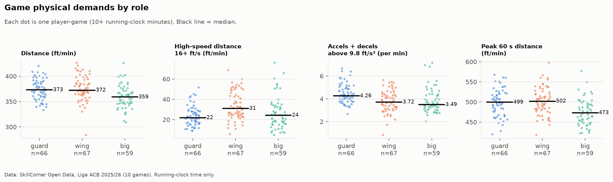
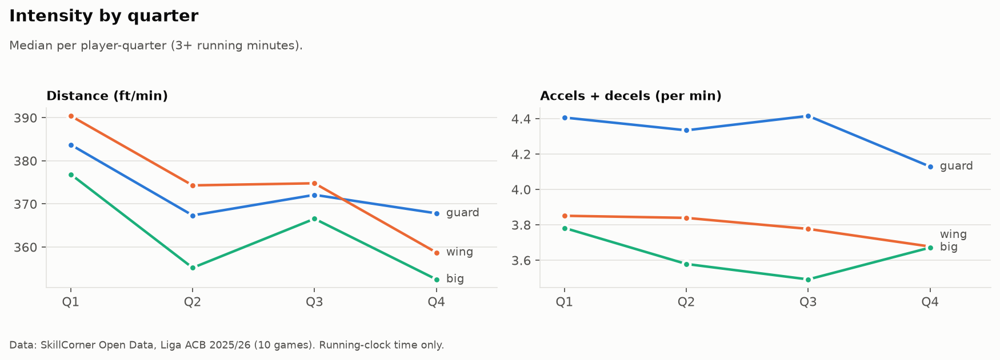
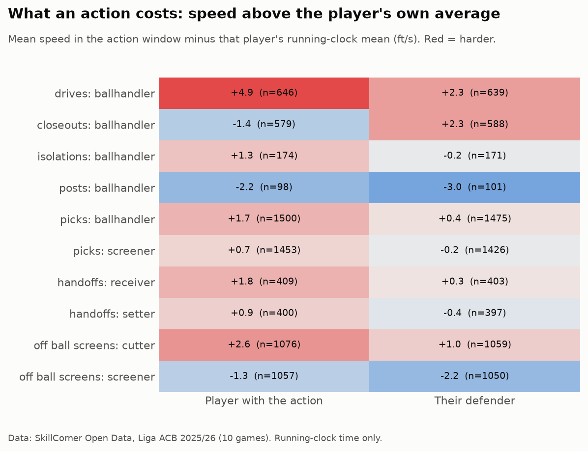
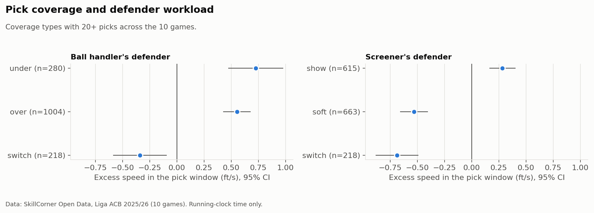
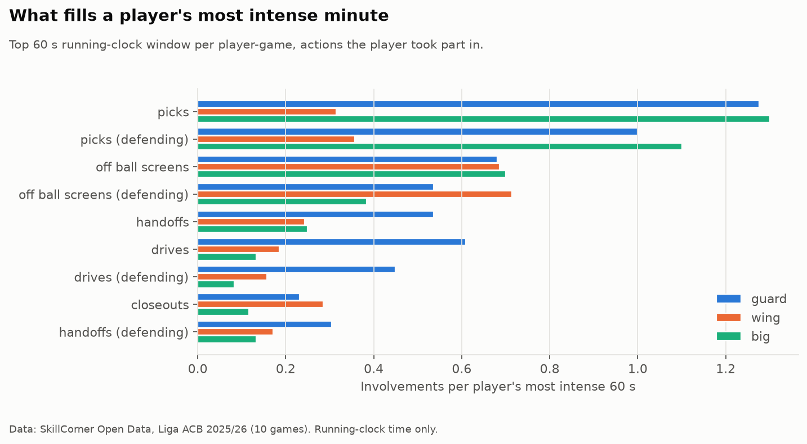
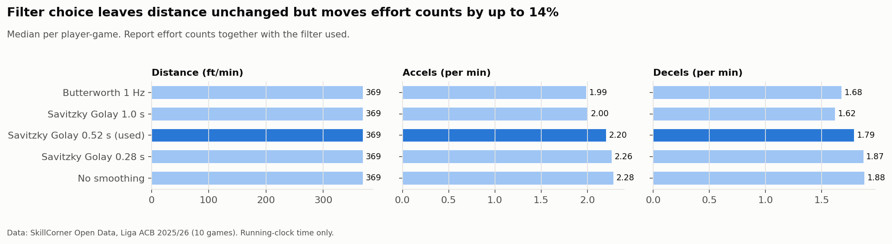

# waims-tracking-lab

**What does a basketball action cost?** Game physical demands and action-level load from broadcast tracking.

This project uses SkillCorner's open tracking data (Liga ACB 2025/26, 10 games, 25 fps) and does two things with it:

1. It profiles the external load of a pro game **by role and by quarter**.
2. It measures the **physical cost of each tactical action** (drive, pick, closeout and so on) for the player running it and for their defender.

It also feeds real pro benchmarks into [WAIMS](#waims-integration).

Built by Chris Cothern, PT, CSCS, CPSS. Data: [SkillCorner Open Data](https://github.com/SkillCorner/opendata-basketball) (MIT). Thanks to SkillCorner for releasing it.

**Live app:** interactive version on Streamlit, with role benchmarks, action cost, a "compare your athlete" tool and the peak-minute videos. Run it locally with `streamlit run app.py`.

## Findings

All values use running-clock time only (the game clock is live). Distances are in feet; meters are shown in brackets where useful. The sample is 192 player-games with at least 10 minutes each, from 174 players.

**1. Guards and wings cover the same ground, but in different ways.**

| Role | Distance, ft/min | High-speed distance (16+ ft/s), ft/min | Accels + decels per min | Peak 60 s, ft/min |
|---|---|---|---|---|
| Guard | 373 (114 m) | 22 | **4.3** | 499 (152 m) |
| Wing | 372 (113 m) | **31** | 3.7 | 502 (153 m) |
| Big | 359 (109 m) | 24 | 3.5 | 473 (144 m) |

Wings do the most high-speed running, while guards do the most accelerating and braking.



**2. A player's most intense minute runs about a third above their game average,** for every role. Conditioning built around game averages underprepares players for these peak stretches.

**3. Intensity fades, and the wing drop is the largest.** Distance per minute falls from Q1 to Q4 by about 8% for wings, 6.5% for bigs and 4% for guards. Guards hold their effort rate until the fourth quarter.



**4. Drives are the most expensive offensive action, and closeouts are the sharpest defensive cost.**

Each value below is speed inside the action window minus the same player's own game average, which controls for players who are simply always fast.

| Action | Excess speed | Duration | Notes |
|---|---|---|---|
| Drive, ball handler | +4.9 ft/s | 2.5 s | Most expensive offensive action |
| Drive, defender | +2.3 ft/s | 2.5 s | |
| Closeout, defender | +2.3 ft/s | 1.3 s | Highest effort rate of any role in any action: 20 per min |
| Off-ball screen, cutter | +2.6 ft/s | 4 s | |
| Off-ball screen, cutter's defender | +1.0 ft/s | 4 s | |
| Post-up, both players | below average | | Tracking does not capture contact load |



**5. Pick coverage changes defender workload.** Switching costs both defenders less than going over or under (ball handler's defender) or showing (screener's defender). Coverage choice is also a load-management lever.



**6. Different actions fill each role's peak minute.** Measured against their average minute, a guard's most intense minute includes about **2 times more drives and handoffs**. A wing's includes about **1.4 times more chasing through off-ball screens and closing out**. For bigs, it is mostly picks.



## Video: peak minute replay

`scripts/render_clip.py` turns a player's peak minute into a 1080p MP4 (68 s: intro, the minute in real time, outro). It shows:
- A 2D court replay of all ten players and the ball. Hollow dots are positions estimated off-camera.
- The focus player's speed trail.
- Live speed, distance, pace against his own game average, and hard accelerations and decelerations.
- A speed trace and the actions he takes part in as they happen.

The auto-picked sample is a Barcelona guard in Q3 against Gran Canaria. In one minute he chases through two screens, guards an isolation and a drive, then receives a handoff, runs a pick and roll, cuts off a screen and drives to the rim. That adds up to:
- **484 ft**, which is 31% above his own game pace
- **10 hard efforts**, which is 2.4 times his game rate
- a top speed of **20.3 ft/s**

```powershell
python scripts/render_clip.py                          # best guard peak minute
python scripts/render_clip.py --role wing              # best wing
python scripts/render_clip.py --game 188630 --player 59161
python scripts/render_clip.py --stills 80 800 1400     # check frames as PNGs, no MP4
```

Videos are written to `exports/video/` (gitignored, about 13 MB each), sized for LinkedIn, the portfolio and Filmora edits. Compressed copies used by the app (about 1.6 MB each) live in `assets/video/`.

## How a performance staff would use this

- **Drill design by role.** Build conditioning blocks to the peak 60 s demand, not the game average. Put them into the actions that fill that minute: pick and drive work for guards, screen chasing and closeouts for wings.
- **Explaining load.** When a player's game load spikes, the action tables show why. More drives or more switching assignments change the physical cost.
- **Scheme conversations.** Coverage choices carry a physical cost. That becomes relevant late in the season, or when a key defender is on managed minutes.
- **Benchmarks for WAIMS.** Role bands (10th, 50th and 90th percentiles) give a pro reference to compare a team's own tracking or GPS data against.

## Methods, briefly

- **Cleaning.** The provided speed matches position-derived speed (r = 0.998). It is capped at 26 ft/s to remove rare artifacts, then smoothed with a Savitzky Golay filter (0.52 s window) inside continuous segments. Acceleration is the first difference of smoothed speed.
- **Efforts.** An acceleration or deceleration counts when it exceeds 9.8 ft/s² (about 3 m/s²) for at least 0.3 s. A sprint means 20+ ft/s for at least 0.5 s.
- **Peak windows.** These are the best rolling 30 s and 60 s stretches of running clock within a period. Windows are never allowed to span a stint on the bench.
- **Roles.** Positions are not in the data, so roles come from on-court behavior pooled across games: touches, drives, picks as ball handler vs screener, off-ball screens, posts, rebounds, shot mix, and touch distance from the rim. The default is a transparent scoring rule. A k-means clustering agrees on 80% of players.
- **Action cost.** Span actions (drives, closeouts, isolations, posts) use their own start and end frames. Single-frame actions (picks, handoffs, off-ball screens) use a window of 2 s either side.

**Validation (see `tests/`):**
- Running-clock minutes total 197 per team in the reference game, against 200 expected. Totals across all games range from 192 to 221; the high end is an overtime game.
- The top player's minutes match SkillCorner's own `minutesPlayedBefore` within 0.1 min.
- The event-to-tracking join passes face-validity checks. For example, ball handlers on drives are faster than their defenders, and blowby drives are faster still.



## Limitations

- **Broadcast tracking.** About 17% of positions are extrapolated rather than detected. Distance per minute measured on detected frames only is 1 to 4% lower. Every row carries its detected share.
- **Locomotion only.** Players are tracked on the ground (z = 0), so jumps, contact and upper-body work are not captured. Post-ups look "cheap" for exactly that reason.
- **Filter-dependent effort counts.** Counts move by up to 14% depending on the filter (see figure). Always report them together with the method used.
- **Sample size.** With 10 games, most players appear once or twice. The results describe demands by role, not individual baselines.
- **Transfer.** This is ACB men's professional basketball (40 minute games, FIBA court). Transfer to the NBA, WNBA or college game is an assumption, not a finding.

## Run it

```powershell
pip install -r requirements.txt
python scripts/download_data.py     # about 380 MB into data/raw (gitignored)
python scripts/build_all.py         # about 70 s: results, WAIMS exports, figures
python -m pytest -q
```

You don't need Git LFS: the download script fetches the tracking files over HTTPS.

## Layout

```
src/wtl/
  io.py       load game data, events, tracking (cached to parquet)
  clean.py    segments, cap, smoothing, acceleration
  metrics.py  distance, zones, efforts, peak windows
  roles.py    event-derived roles
  actions.py  load inside action windows
  viz.py      figures
  replay.py   animated peak-minute MP4
scripts/      download_data.py, build_all.py, render_clip.py
exports/      waims/ (CSV for WAIMS), figures/ (PNG)
data/         raw/ and interim/ (gitignored; full-detail results in data/interim/results)
```

## WAIMS integration

WAIMS reads only the files in `exports/waims/`:

| File | Grain | Use in WAIMS |
|---|---|---|
| `game_demands_player.csv` | player-game | Real pro game loads. Players are anonymized as "Player NN". |
| `role_benchmarks.csv` | role x metric | 10th / 50th / 90th percentile bands |
| `role_by_quarter.csv` | role x period | Quarter intensity profile. Period 5 is overtime. |
| `action_cost.csv` | action x actor x role | Action cost table |

In WAIMS, show this as a separate "Game Demands (real pro data)" view, labeled as SkillCorner ACB data and kept apart from the synthetic demo roster.
